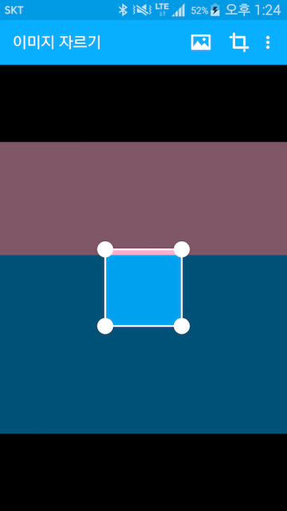

# Android-ImageCropper
Image crop view for android

## Screenshot
 

see
https://play.google.com/store/apps/details?id=com.crust87.imagecropper

## Example

add build.gradle<br />
``` groovy
compile 'com.crust87:image-cropper:1.7.1'
```

create view and add view<br />
```java
mImageCropper = new ImageCropper(getApplicationContext());
mContainerImageCropper.addView(mImageCropper);
```

or append your layout xml<br />
```xml
<FrameLayout xmlns:android="http://schemas.android.com/apk/res/android"
    xmlns:imageCropper="http://schemas.android.com/apk/res-auto"
    android:layout_width="match_parent"
    android:layout_height="match_parent">

    <com.crust87.imagecropper.ImageCropper
        android:id="@+id/imageCropper"
        android:layout_width="match_parent"
        android:layout_height="match_parent"
        imageCropper:box_color="#ffffff"
        imageCropper:box_type="circle"
        imageCropper:line_width="2dp"
        imageCropper:anchor_size="20dp" />

</FrameLayout>
```

and set image Uri<br />
```java
mImageCropper.setImage(imageUri);
```

and crop<br/>
```java
Bitmap cropedImage = mImageCropper.crop();
```

you can set listener to crop box position and width change<br/>
```java
mImageCropper.setOnCropBoxChangedListener(new ImageCropper.OnCropBoxChangedListener() {
        @Override
        public void onCropBoxChange(CropBox cropBox) {
                mTextCropX.setText("crop x: " + cropBox.getCropX());
                mTextCropY.setText("crop y: " + cropBox.getCropY());
                mTextCropWidth.setText("crop width: " + cropBox.getCropWidth());
                mTextCropHeight.setText("crop height: " + cropBox.getCropHeight());
        }
});
```

## Documents
### XML
| Attribute | Value | Description |
|:---|:---|:---|
| box_type | String (circle or rect) | Crop box type |
| box_color | color | Crop box Color |
| line_width | dimension | Crop box line width |
| anchor_size | dimension | Anchor diameter |

### Java
| Method Name | Parameters | Return | Description |
| setImage | Uri | | Set image by Uri |
| setImage | File | | Set image by File |
| setImage | String | | Set image by String that file path |
| crop | | Bitmap | Return cropped image as crop box
| setOnCropBoxChangedListener | OnCropBoxChangedListener | | Set listener lesten crop box attributes change |
| setBoxColor | int | | Set crop box color |
| setBoxColor | String | | Set crop box color by color code |
| setBoxType | int | | Set crop box type, 0 is circle and 1 is rect |
| setLineWidth | int | | Set crop box line width by pixel |
| setAnchorSize | int | | Set anchor diameter by pixel |
| isImageOpen | | isImageOpen | Return if image has opened

## Licence
Copyright 2015 Mabi

Licensed under the Apache License, Version 2.0 (the "License");<br/>
you may not use this work except in compliance with the License.<br/>
You may obtain a copy of the License at

http://www.apache.org/licenses/LICENSE-2.0

Unless required by applicable law or agreed to in writing, software<br/>
distributed under the License is distributed on an "AS IS" BASIS,<br/>
WITHOUT WARRANTIES OR CONDITIONS OF ANY KIND, either express or implied.<br/>
See the License for the specific language governing permissions and<br/>
limitations under the License.

<br />
<div>Icons made by <a href="http://www.freepik.com" title="Freepik">Freepik</a> from <a href="http://www.flaticon.com" title="Flaticon">www.flaticon.com</a> is licensed by <a href="http://creativecommons.org/licenses/by/3.0/" title="Creative Commons BY 3.0">CC BY 3.0</a></div>
