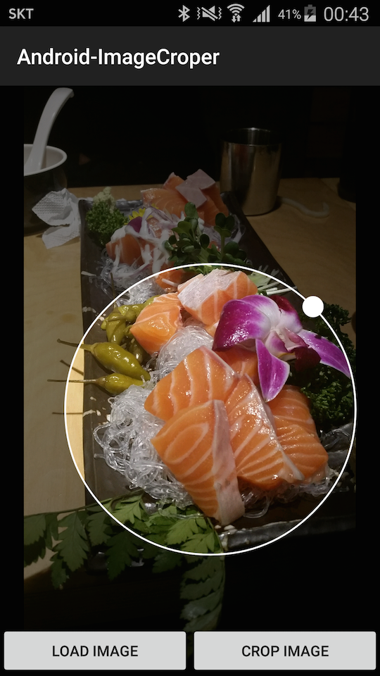

# Android-ImageCroper
Image crop view for android

I'am trying to make library this project.\\
Maybe first virsion only provide crop as square.

This library can not crop original bitmap. 
only crop resized bitmap as screen size. 
I will fix it as soon as i can. 

## Example

request image
```java
Intent lIntent = new Intent(Intent.ACTION_PICK);
lIntent.setType("image/*");
lIntent.addFlags(Intent.FLAG_ACTIVITY_CLEAR_TOP);
startActivityForResult(lIntent, 1000);
```

create view and add view
```java
mImageCroper = new ImageCroper(getApplicationContext(), selectedImageUri);
mContainerImageCroper.addView(mImageCroper);
```



and crop
```java
Bitmap cropedImage = mImageCroper.crop();
```

## Licence
Copyright 2015 Mabi

Licensed under the Apache License, Version 2.0 (the "License"); you may not use this work except in compliance with the License. You may obtain a copy of the License at

http://www.apache.org/licenses/LICENSE-2.0

Unless required by applicable law or agreed to in writing, software distributed under the License is distributed on an "AS IS" BASIS, WITHOUT WARRANTIES OR CONDITIONS OF ANY KIND, either express or implied. See the License for the specific language governing permissions and limitations under the License.
