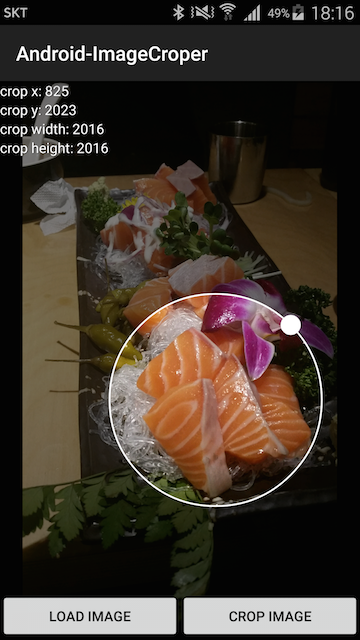

# Android-ImageCroper
Image crop view for android

I'am trying to make library this project.<br/>
Maybe first virsion only provide crop as square.

## Example

create view and add view
```java
mImageCroper = new ImageCroper(getApplicationContext());
mContainerImageCroper.addView(mImageCroper);
```

or append your layout xml
```xml
<com.mabi87.imagecroper.ImageCroper
        android:layout_width="match_parent"
        android:layout_height="match_parent"
        android:id="@+id/imageCroper"/>
```

request image
```java
Intent lIntent = new Intent(Intent.ACTION_PICK);
lIntent.setType("image/*");
lIntent.addFlags(Intent.FLAG_ACTIVITY_CLEAR_TOP);
startActivityForResult(lIntent, 1000);
```

and set image Uri
```java
mImageCroper.setImage(selectedImageUri);
```



and crop
```java
Bitmap cropedImage = mImageCroper.crop();
```


you can set listner to crop box position and width change
```java
mImageCroper.setOnCropBoxChangedListener(new ImageCroper.OnCropBoxChangedListener() {
        @Override
        public void onCropBoxChange(CropBox cropBox) {
                mTextCropX.setText("crop x: " + cropBox.getCropX());
                mTextCropY.setText("crop y: " + cropBox.getCropY());
                mTextCropWidth.setText("crop width: " + cropBox.getCropWidth());
                mTextCropHeight.setText("crop height: " + cropBox.getCropHeight());
        }
});
```

## Licence
Copyright 2015 Mabi

Licensed under the Apache License, Version 2.0 (the "License");<br/>
you may not use this work except in compliance with the License.<br/>
You may obtain a copy of the License at

http://www.apache.org/licenses/LICENSE-2.0

Unless required by applicable law or agreed to in writing, software<br/>
distributed under the License is distributed on an "AS IS" BASIS,<br/>
WITHOUT WARRANTIES OR CONDITIONS OF ANY KIND, either express or implied.<br/>
See the License for the specific language governing permissions and<br/>
limitations under the License.
